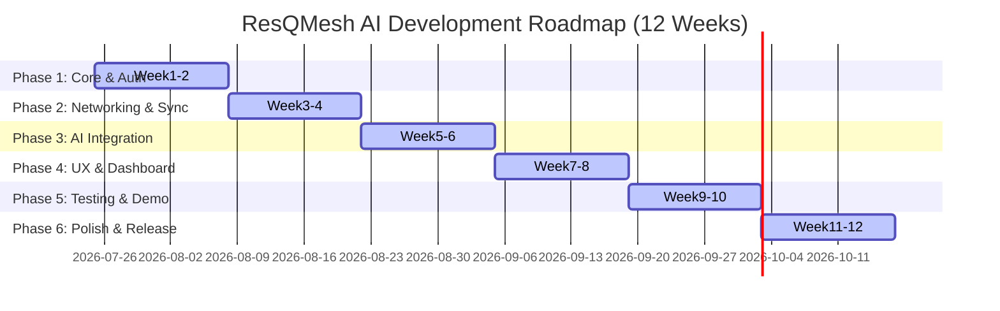

# Executive Summary  
ResQMesh AI is an **offline-first** emergency response platform combining peer-to-peer mesh networking with on-device AI. It lets mobile users (Android/iOS) report incidents and request help even with no internet, while a local “command center” laptop runs a lightweight local LLM for intelligent assistance. Key components include React Native mobile apps, a laptop dashboard (Electron/Tauri), and an AI inference engine (Ollama/llama.cpp). Devices discover peers via Wi-Fi Direct or Bluetooth, forming a dynamic mesh. Incidents, messages and updates are exchanged in real time when possible, or queued for store-and-forward delivery when offline (a **Delay-Tolerant Network** approach). Data is synchronized using unique IDs and simple conflict resolution (e.g. vector clocks or last-writer-wins) to ensure convergence. End-to-end encryption and authentication secure all communications. An embedded AI pipeline (extractor, severity classifier, RAG retriever, summarizer) uses a quantized local LLM (e.g. Llama 3, Phi-3 mini) to analyze reports and suggest SOPs. The design is fully implementable in ~3 months: initial weeks focus on architecture, auth, and data model; followed by networking and offline sync, then AI features, UI/dashboard, and robust testing. Sources from DTN/mesh research, LLM performance studies, and industry best practices have guided these designs.

## Vision & Goals  
ResQMesh AI empowers first responders and community volunteers to coordinate **reliably and intelligently** during disasters **without internet**. Its vision is an adaptive mobile mesh network where any group of smartphones and a laptop form a self-healing emergency coordination system. Key goals are: offline resilience (auto store-and-forward of messages), secure P2P comms, and localized AI support (e.g. on-the-fly incident summarization and SOP retrieval). By combining mesh networking and local LLM intelligence, ResQMesh ensures teams stay connected and informed even in chaos.

## User Roles & Use Cases  
- **Responder (Mobile User):** Creates incident reports (e.g. “collapsed bridge”, “multiple injured”), requests/updates help, and views nearby incidents. Uses smartphone app.  
- **Coordinator (Laptop Dashboard):** Monitors all incidents on a map, assigns tasks, views AI-generated summaries and suggested actions (SOPs). Uses web or desktop app.  
- **Network Operator (Device):** All devices participate as peers in the mesh. Each can relay messages (mesh hop).  
- **Admin (First-Time Setup):** Establishes initial mesh security (exchange keys/credentials via QR code or local USB). On first launch, each device registers locally (no central server needed).  

_User flows:_ A responder at an accident site opens the app, reports “fire in building” (setting location, severity, photos). The report is saved locally and broadcast to peers (via Wi-Fi Direct/Bluetooth). Nearby users and the laptop receive it, add comments (“need firefighters”), and get AI assistance: the LLM extracts keywords (“fire, building collapse”), classifies severity (high), and retrieves SOP from the local knowledge base (e.g. “evacuation protocol”). All actions sync across devices when network permits.  

## Key Features (Prioritized)  
1. **Offline Mesh Communication:** Peer discovery (mDNS/Bluetooth), multi-hop routing, store-and-forward of events.  
2. **Incident Reporting & Chat:** Structured reports (location, type, severity), group chat, file sharing (photos).  
3. **Local AI Assistance:** On-device LLM pipeline with RAG (Knowledge base of SOPs). Tasks: extract incident details, classify severity, summarize updates, suggest actions.  
4. **Secure Sync & Conflict Handling:** UUIDs for all records, versioning (timestamps/vector clocks) for merges, CRDT or LWW as needed.  
5. **Authentication & Encryption:** Each device uses public-key credentials or shared symmetric keys. E2E encryption on all messages.  
6. **Dashboard & UX:** Command-center UI with map and incident list; simple mobile UI for quick actions.  

Advanced features (time permitting): leadership election for multi-laptop scenarios, energy-aware routing, plugin architecture for adding sensor inputs.

## System Architecture  

```mermaid
graph TD
  subgraph "Mobile Devices (React Native)"
    M1[Phone<br/>(Android/iOS)] 
    M2[Phone<br/>(Android/iOS)] 
    M3[Phone<br/>(Android/iOS)]
  end
  subgraph "Command Center (Laptop)"
    L[Desktop App/Browser]
    AI[LLM Inference Engine]
    DB[(Local DB (SQLite))]
  end
  subgraph "Optional Cloud/Internet"
    Cloud[(Cloud Server/WebSocket)] 
  end
  
  M1 & M2 & M3 -- "Bluetooth / Wi-Fi Direct P2P" -->|Mesh Links| M1 & M2 & M3 & L
  M1 & M2 & M3 -- "LAN/Wi-Fi" --> L
  L -- "WebSockets/API" --> Cloud

  L -- CLI/GUI --> AI
  L -- R/W --> DB
  M1 & M2 & M3 -- R/W --> SQLite on device
```

**Figure:** High-level architecture. Mobile phones connect via peer-to-peer Wi-Fi Direct or Bluetooth (mesh links). All devices relay messages; one or more laptops act as command centers. If internet is available, the laptop may also sync with a cloud server. Both phones and laptop store data locally (SQLite). The laptop runs a local LLM inference engine (Ollama/llama.cpp) to provide AI responses.  

Each mobile includes modules for: UI, Local DB, Network Manager (Wi-Fi/Bluetooth, mDNS), Sync Engine (store-forward queue), and API layer. The laptop has an additional AI module (LLM & vector store) and a richer UI/dashboard. The **component responsibilities** are summarized below.

| Component            | Responsibilities                                                                                               |
|----------------------|---------------------------------------------------------------------------------------------------------------|
| Mobile App (RN)      | Incident CRUD UI, local DB sync, peer discovery, event publish/subscribe, encryption/decryption, notifications |
| Network Manager      | Discover peers (mDNS/Zeroconf on LAN; Wi-Fi Direct/Bluetooth scan), manage peer links, health checks            |
| Sync Engine          | Queue outgoing events when offline, merge incoming events, apply conflict-resolution (vector clock or LWW)     |
| Local Database (SQLite) | Store incidents, messages, resources locally. Maintain version vectors/UUIDs for conflict detection           |
| AI Inference Engine  | Run LLM (llama.cpp/Ollama) on-device, manage embeddings store (ANN index), perform RAG retrieval                |
| Server/Dashboard     | Display aggregated incidents on map, user authentication, dispatch controls, call AI pipeline, sync bridge      |
| WebSocket/HTTP Layer | Provide API for real-time messaging and sync (when internet is available) using protobuf/JSON                 |

**Diagram:** A **sequence flow** for incident reporting and AI analysis might be:

```mermaid
sequenceDiagram
    participant U as User
    participant M as MobileApp
    participant N as MeshNetwork
    participant P as PeerDevice
    participant L as CommandCenter
    participant A as AIEngine

    U->>M: Submit Incident {type, location, details}
    activate M
    M->>M: Save to LocalDB (UUID, timestamp)
    M->>N: Publish event "IncidentCreated"{incidentData}
    deactivate M

    N-->>PeerDevice: Relay "IncidentCreated" event
    PeerDevice->>PeerDevice: Save to LocalDB
    PeerDevice-->>N: Acknowledge

    N-->>L: Deliver "IncidentCreated"
    L->>L: Save to DB; Update dashboard
    L->>A: invokeAnalyze(incidentData)
    A->>A: Extract key info, classify, retrieve SOP docs, summarize
    A-->>L: {severity, summary, SOP}
    L->>L: Save AI analysis to DB
    L->>N: Broadcast "AnalysisReady"{incidentId, AIresults}
    deactivate L

    N-->>M: "AnalysisReady"
    M->>M: Update UI with AI results
```

This flow shows an incident created on one phone being propagated through the mesh to peers and the command center, which then engages the AI pipeline and broadcasts the analysis back into the mesh.  

## Data & Event Schemas  

All shared objects use **UUIDs** and timestamps. Key tables/events include: incidents, chat messages, resource updates, and acknowledgements. We suggest using simple JSON/Protobuf schemas. Example event fields:

| Event Type        | Example Fields                                                          | Purpose                                       |
|-------------------|--------------------------------------------------------------------------|-----------------------------------------------|
| incident_created  | id, uuid, createdAt, reporterId, latitude, longitude, type, description, severity, attachments | A new incident report                        |
| chat_message      | id, uuid, timestamp, fromId, toId(s), text, attachments                 | Group chat or direct message                 |
| status_update     | id, uuid, incidentId, timestamp, status (e.g. “acknowledged”, “resolved”) | Status change for an incident               |
| resource_request  | id, uuid, requesterId, resourceType, quantity, urgency, relatedIncidentId | Requests for resources (ambulance, water)    |
| sync_ack          | id, uuid, sourceDevice, targetDevice, lastSyncTimestamp                | Acknowledgement of sync point                |
| ai_analysis       | id, incidentId, generatedAt, severity, keywords[], summary, SOPids[]    | Result from AI pipeline                      |

**Table:** Example event schemas. Each event carries a UUID and timestamp. Attachments (photos, logs) are referenced by URI. These tables would map to SQLite tables on devices. All fields are JSON-serializable (or Protobuf) for transmission.  

Events can be versioned by a simple monotonic counter or vector clock per device. For example, each device keeps a local `deviceClock` that increments per new record. Events include `{deviceId, deviceClock}`; merging uses “happened-before” or LWW (see conflict resolution).  

## Networking & Synchronization  

**Transports:** ResQMesh supports multiple link layers:

- **Wi-Fi Direct (P2P):** Fast (~50–150 Mbps), moderate range (~50m), higher power draw. Good for large data (photos, maps) between nearby Android devices. Limited iOS support.  
- **Bluetooth/BLE:** Low power, short range (~10m), data rates 1–2 Mbps. Suitable for text or small updates. BLE Mesh extends range via hops (up to ~100 nodes) but with low throughput.  
- **Wi-Fi LAN (mDNS):** On common Wi-Fi (AP-enabled), devices can discover each other via mDNS/Bonjour. Throughput ~100 Mbps, but requires infrastructure or hotspot.  
- **Internet/WebSocket:** When available, devices (especially the laptop) can connect to a central server for wider reach (e.g. cloud sync). This is a *persistent contact* in DTN terms.

| Transport        | Range        | Throughput    | Power  | Pros                             | Cons                               |
|------------------|--------------|---------------|--------|----------------------------------|------------------------------------|
| Wi-Fi Direct (P2P) | ~50m        | High (~100Mbps) | High   | Fast data, mesh capable | Android-only, high power |
| Bluetooth LE      | ~10m         | Low (~1-2Mbps) | Low    | Ultra-low power, ubiquitous | Short range, low data rate          |
| BLE Mesh         | ~>100m (multi-hop) | <1Mbps      | Low    | Supports large node count, self-healing | Very low throughput, complex routing |
| Wi-Fi LAN + mDNS | <100m (indoor) | High (~100Mbps) | High   | Works on existing Wi-Fi, reliable** | Needs AP / internet (until fallback to mesh) |
| Cellular/Internet | Global       | High (100s Mbps) | Medium | Long range, fallback to cloud      | May be unavailable in disaster, cost |

**Table:** Comparison of transports. Wi-Fi Direct and LAN offer high speed; BLE is slower but power-efficient. Note: real-world throughput varies. As Kaspersky notes, any active Bluetooth/Wi-Fi Direct use increases battery drain.  

**Peer Discovery:** On Wi-Fi LAN, use **mDNS/Bonjour** (e.g. via `react-native-zeroconf`) to advertise a “ResQMesh” service. On Android, Wi-Fi Direct has built-in peer discovery APIs (scan/advertise). For Bluetooth, use classic BLE advertising (e.g. using `react-native-ble-plx`) to broadcast device presence and accept connections. Each device periodically announces itself; on discovery, a TCP/UDP socket connection or BLE L2CAP channel is opened for data exchange.  

```javascript
// Pseudo-code: Wi-Fi Direct discovery with React Native (Android-only)
import WifiP2p from 'react-native-wifi-p2p';
WifiP2p.initialize();
WifiP2p.createGroup();  // make device discoverable
WifiP2p.on('deviceFound', peer => {
  // establish socket if discovered ResQMesh peer
  if (peer.deviceName.startsWith("ResQMesh")) connectToPeer(peer);
});
```

```javascript
// Pseudo-code: mDNS discovery using react-native-zeroconf
const zeroconf = new Zeroconf();
zeroconf.on('resolved', (service) => {
  if (service.name === 'ResQMesh') {
    peers.add(service.addresses[0]);
  }
});
zeroconf.scan('._resqmesh._tcp.', 'local.');
```

**Message Formats:** Events (see table above) are JSON or Protobuf. Each record includes: `uuid`, `timestamp` (e.g. ISO string or ms since epoch), `deviceId`, and any payload fields. For small size, Protobuf could reduce bandwidth, but JSON is simpler and human-readable. We will use JSON over the wire (HTTP/WebSocket or sockets).

**Store-and-Forward Sync:** Based on DTN principles, each device stores new events locally and immediately broadcasts them to all connected peers. If a peer is unreachable, events queue in a local outbox. On re-connection, queued events are sent. To avoid duplicates, each event has a UUID; receivers ignore already-seen IDs. 

```python
# Pseudo-code: Store-and-forward
outbox = Queue()
def publish_event(event):
    saveToLocalDB(event)
    if peers.isEmpty():
        outbox.enqueue(event)
    else:
        for peer in peers:
            peer.send(event)
def on_peer_connected(peer):
    while not outbox.isEmpty():
        peer.send(outbox.dequeue())
```

Devices continuously attempt new connections (e.g. BLE scans every few seconds, Wi-Fi Direct reconnections). This ensures eventual delivery even with intermittent links.

**Synchronization Protocol:** All devices share a simple protocol:
- On connect, devices exchange a summary of “known events” (e.g. highest timestamp or vector clock for each data type).  
- Then, they exchange any missing events. For efficiency, we send only deltas (new UUIDs). This is analogous to “sync handshake”.  
- Messages are acknowledged; unacknowledged messages remain in outboxes for retry.

We favor **last-writer-wins (LWW)** for scalar fields (tied to timestamp) due to simplicity. For compound records, a simple CRDT strategy (e.g. merging chat logs by timestamp) ensures consistency.  

**Conflict Resolution:** Each record has `lastUpdated` timestamp and `deviceClock`. When two devices concurrently edit the same field offline, we use LWW: the version with the later timestamp wins. (Ditto warns LWW can drop edits, but for this prototype it is acceptable.) Optionally, implement vector clocks: each device maintains a map `{deviceId: counter}`, merging by component-wise max, and detects concurrency (for manual resolution). Pseudocode for LWW merge:

```python
def resolve(record_local, record_remote):
    if record_local['lastUpdated'] >= record_remote['lastUpdated']:
        return record_local
    else:
        return record_remote
```

For list-like data (chat history), simply append new messages (UUID prevents duplication). For event logs (e.g. resource updates), we keep all entries (logs are append-only).

## Security & Privacy  

**Authentication:** On first use, each device generates a public/private key pair (e.g. Ed25519). Devices exchange public keys via a QR code or USB/airdrop in the field. Thereafter, every message is signed. Alternatively, a shared symmetric key (from a pre-shared passphrase) can be used. Unique device IDs (e.g. public key hash) identify senders.

**Encryption:** All communications are end-to-end encrypted. We use a combination of TLS for WebSockets (if internet) and libs like libsodium for P2P channels. For simplicity, we encrypt payloads with a shared group key (rotated if a new device joins). Kaspersky notes that well-designed mesh apps use E2E encryption so intermediate hops cannot read messages. Implement **AES-GCM** encryption at the application layer for each event block, with session keys established by initial handshake.

**Offline Onboarding:** In absence of central CA, trust is bootstrapped by physical proximity. Devices pair in person: e.g. scan each other’s QR codes (contains public key fingerprint). This QR code pairing creates an initial trust circle. After that, all new devices are auto-joined but untrusted until manually approved. 

**Data Protection:** Local storage (SQLite DB) is encrypted at rest (using SQLCipher) to protect sensitive info on lost/stolen devices. Incident reports may contain PII (names of victims); we restrict retention (auto-delete after event closed) and use it only on-device.

**Privacy:** By design, no central server logs messages, and no personal info (like phone numbers) is required. Group IDs or pseudonyms are used.

## AI Design (Local LLM)  

We embed a local LLM on the laptop to process incidents. Options include **Ollama**, **llama.cpp**, or **MLC-LLM** running a quantized model on CPU/GPU. All run fully on-device (no cloud inference), preserving privacy.

**Model Selection:** We compare several open models (quantized):

| Model            | Parameters | FP16 Disk | 4-bit VRAM | Inference (tokens/sec) |
|------------------|------------|-----------|------------|------------------------|
| Llama 3 8B       | 8B         | ~15GB     | ~5–6 GB | ~50–85 (4090 GPU) |
| Phi-3 Mini 4K 3.8B | 3.8B     | ~8GB      | ~1.8–2.0 GB | ~40–60                |
| Qwen 3 Coder 8B  | 8B         | ~16GB     | ~4.6 GB  | ~50–80                |

**Table:** Example model requirements. Qwen 3 (8B) uses ~4.6GB VRAM at 4-bit, similar to Llama3 8B (~5GB). Phi-3 mini (3.8B) is much smaller (~2GB). All run in GGUF format (used by llama.cpp/Ollama). Inference speed depends on hardware; modern GPUs can do tens of tokens/sec (e.g. RTX 4090 ~70 tok/s for 8B). LLM RAM usage grows with context length; our use (short questions, answers) is moderate.

**Quantization:** We will use 4-bit quantized models (e.g. Q4_K_M) to fit on consumer GPUs (8–16GB VRAM). The trade-off is a small quality drop (~2%) for 4-bit vs FP16. 8-bit or higher is possible if hardware allows. Ollama and llama.cpp default to Q4 (GGUF) and support other precisions.

**LLM Runtime:** Ollama provides an easy CLI (`ollama pull`) to fetch and run models. llama.cpp can run GGUF models on CPU/GPU with `./main -m model.gguf`. MLC-LLM or MLX could be considered for speed on Apple Silicon or multi-thread. A comparative study notes llama.cpp is very efficient for single-thread tasks, while Ollama trades some speed for usability. We will likely use Ollama for simplicity and portability (it even automates quantization).

**AI Pipeline:** On incident arrival, the command center does:  
1. **Extraction:** Use a small parser or regex to pull key info (location, persons, etc.).  
2. **Severity Classification:** A lightweight classifier (could be a small fine-tuned model or prompt) tags the incident as High/Med/Low.  
3. **Retrieval (RAG):** Incident text is embedded (e.g. with a sentence-embedding model) and compared against a local vector store of SOP documents (indexed via FAISS or similar). Top-k relevant SOP snippets are fetched.  
4. **Summarization:** A prompt template feeds the incident details plus top SOP excerpts to the LLM, asking for an action plan summary.  

Example pseudo-workflow (Python-like):

```python
incident = db.get_incident(incidentId)
sev = classify_incident(incident.description)
emb = embed_model.encode(incident.description)
docs = vectorDB.search(emb, top_k=5)
prompt = f"Incident: {incident.description}\nSOPs: {docs}\nTask: Summarize situation and suggest actions."
summary = llm.generate(prompt)
publish_event("ai_analysis", {
    "incidentId": incident.id, "severity": sev, "summary": summary, "sopIds": docs.ids
})
```

The RAG pipeline ensures the LLM output is grounded in authoritative SOP texts. Embedding/FAISS could use llama.cpp built-ins or libraries (e.g. sentence-transformers, hnswlib). The vector index (possibly SQLite or a file) is synced from the laptop to mobiles as needed for offline RAG support (or just kept on laptop).  

**AI on Node vs Dedicated:** We assume the laptop is the primary AI node (most memory/CPU). Phones may not run heavy models. In principle, the mesh could designate a “leader” device (via a simple election or static role) to run the LLM. Leader election could use a lightweight algorithm (e.g. the device with highest ID or longest uptime). If multiple laptops, they must coordinate (e.g. RAFT or Bully algorithm). For simplicity, **one laptop** acts as AI server; other devices only consume AI results.  

**Modularity:** The AI pipeline is modular: the extractor, classifier, RAG retriever, and generator are separate functions. This allows substitution (e.g. swap classifier model, update SOPs, etc.). Prompt templates are versioned on disk.  

## Deployment & Topology  

**Device Targets:** Android 10+ (API 29+) and modern iOS for mobile apps. Laptop: any OS (Windows/Linux/macOS) with >=8GB RAM, optional GPU (>=8GB VRAM) for LLM. At least one device (laptop or tablet) acts as command center; additional laptops work in collaborative mode. We assume **50-100 devices** maximum in mesh; beyond that latency/bandwidth degrade.  

**Network Topology:** In a disaster zone, devices form a mobile ad-hoc network (MANET). Connections are opportunistic: phones connect when in range (peer discovery as above). There is no fixed infrastructure. If a Wi-Fi AP is available, devices may join it and use mDNS to find each other; otherwise they rely purely on P2P links. One device (laptop) could run a soft AP to encourage Wi-Fi linking, but that's optional.  

**Offline-First Approach:** The system works whether or not any internet is present. When connectivity is restored (cellular or local internet), the laptop may optionally sync critical events to a cloud server (for record-keeping or remote team coordination). But core functionality does not rely on the cloud.  

**Stacks & Tech Choices:** 
- **Mobile (React Native):** Cross-platform UI; many native modules exist for Wi-Fi P2P and BLE (e.g. `rn-wifi-p2p`, `react-native-ble-plx`). React Native supports SQLite via libraries (e.g. `react-native-sqlite-storage`). Its ecosystem has Zeroconf/mDNS libraries.  
- **Desktop (Electron or Tauri):** We can build the dashboard as a web app (Django/Flask or FastAPI backend + React/Vue front-end) or as a desktop app. Given offline requirements, **Electron** (with bundled SQLite) is a robust choice; **Tauri** is smaller but less mature. Django or FastAPI can serve the local API. We'll use WebSockets (via Django Channels or Socket.IO) for live updates.  
- **Database:** SQLite on each device (file-based, zero-config). Perfect for mobile offline.  
- **Networking Libraries:** `react-native-wifi-p2p` for Android Wi-Fi Direct, `react-native-ble-plx` for BLE, `react-native-zeroconf` for mDNS. On desktop, we may use Node’s `dgram` sockets for UDP/TCP or Python libraries for Bluetooth if needed (though laptop can act as gateway).  
- **Messaging:** Use JSON or lightweight binary (protobuf) over sockets. JSON is easy; we can use libraries like `protobuf.js` if needed.  
- **LLM Runtime:** Ollama CLI or llama.cpp (C++). Ollama can be installed via `curl https://ollama.com/install.sh` and models pulled `ollama pull llama3:8b`. Llama.cpp can run `./llama -m llama3-8b.gguf`. MLC-LLM is another option but requires Python/TVM build; for simplicity we stick with Ollama/llama.cpp.  
- **Message Queuing:** We’ll write a lightweight sync layer, not use a heavy broker. If needed, libraries like `Paho MQTT` with offline store might inspire design, but rolling our own event bus may suffice.  
- **Encryption/Auth:** Use established libs: e.g. `tweetnacl` or `crypto` (Node.js) for key exchange and AES-GCM. For Bluetooth, we rely on BLE’s built-in pairing or just start encryption at app layer.  
- **UI/UX Frameworks:** Map integration via Google Maps / Leaflet; UI with Material or Ant Design for clear buttons. We will design wireframes focusing on big buttons and large text for field use. The dashboard shows an interactive map of incidents, list filters, and chat panel.  

**Installation & Packaging:** All apps should be distributable offline (no need for App Store). We will bundle React Native apps with over-the-air update disabled, and Electron app as a single installer. For Python/backend, use `pyinstaller` or Electron’s packaging. CI/CD pipelines (GitHub Actions) can build these on commit.

## Development Plan & Timeline  

We propose a 12-week roadmap (3 months) with iterative sprints:



**Weekly Roadmap:**  

| Week | Date Range    | Goals                                          | Deliverables                                        |
|------|---------------|------------------------------------------------|-----------------------------------------------------|
| 1    | 25 Jul – 31 Jul | Set up code repos; design data models; implement user auth (basic login), Incident CRUD API & local DB schema; initial React Native project. | Functional auth (e.g. PIN or cert store), Incident create/save/view. |
| 2    | 1 Aug – 7 Aug  | Complete CRUD (Update/Delete), basic UI screens; implement static map view; define event schemas; wireframe UX; setup base Electron app (empty dashboard). | Mobile app v0.1 (offline form), data model doc, dashboard skeleton. |
| 3    | 8 Aug – 14 Aug | Integrate peer discovery: add `rn-wifi-p2p` and BLE scanning; test simple device pinging; implement event broadcasting (`incident_created`). | Demo: two phones discover each other and exchange a test message. |
| 4    | 15 Aug – 21 Aug | Develop sync engine: queueing, retry logic; conflict resolution basics (LWW). Simulate offline (airplane mode) and reconnection tests. | Stable mesh syncing: incident from A reaches B after reconnection. |
| 5    | 22 Aug – 28 Aug | Integrate LLM: choose model (e.g. llama3:8b); install Ollama/llama.cpp on laptop; basic test inference. Build embeddings index of SOP docs. | AI engine running locally, able to answer canned prompt. |
| 6    | 29 Aug – 4 Sept | Implement RAG pipeline: incident → embed → retrieve SOP → LLM prompt → summary. Hook to `incident_created` on laptop. | AI-triggered incident summaries, classifier and resource extractor. |
| 7    | 5 Sept – 11 Sept | Build command-center UI: map display of incidents, list view, details panel with AI output; mobile UI polish (lists, maps). | Functional dashboard (shows syncing incidents), phones show incoming AI analysis. |
| 8    | 12 Sept – 18 Sept | Add chat/messaging feature (group chat per incident); file sharing (photo attach). Enhance sync for messages. | Demo: Users chat about an incident, see messages on all devices. |
| 9    | 19 Sept – 25 Sept | Security: implement encryption of messages (AES/GCM), sign messages. Key exchange flow (QR code on mobile). | End-to-end encryption working; encrypted packets on network sniff. |
| 10   | 26 Sept – 2 Oct  | Extensive testing: unit tests for data sync, integration tests on emulators (simulate partitions); handle merge conflicts. | Test reports, fix sync bugs, refine conflict logic. |
| 11   | 3 Oct – 9 Oct   | CI/CD and packaging: Docker or electron-builder builds; offline installer generation; documentation draft. | Automated build pipeline, offline app bundles. |
| 12   | 10 Oct – 16 Oct | Prepare demo scripts, performance testing (stress 10-20 devices via emulators); polish UX; final validation. | Final demo (e.g. simulate earthquake scenario), performance metrics documentation. |

This roadmap assumes two-week sprints, with deliverables at each milestone. We will use Agile with daily standups, and peer code reviews. Early milestones focus on core functionality (auth, data, networking), mid-phase adds AI and UI, and final phase covers security, testing, and polishing.

## CI/CD and Packaging  

We will use GitHub Actions for CI: automated builds on push. Steps include:

- **Mobile:** `yarn android`/`yarn ios` builds. Signed APKs (Android) and TestFlight builds (iOS) generated. Over-the-air updates disabled to ensure offline installs.  
- **Desktop:** Electron builder via `electron-builder` or `npm run make`. Create installers for Win/mac/Linux. SQLite DB and Node modules bundled.  
- **LLM Setup:** Include model binaries (GGUF) as separate downloads or instructions. E.g. instruct: `ollama pull llama3:8b` and store on device. Models may be large (5–10GB) so distribution via USB or local mirror is needed. Possibly use peer-to-peer file sharing (like BitTorrent) for the model weights in the field.

We will document exact install steps: e.g. `pip install fastapi`, `npm install`. Where possible, bundle dependencies to minimize need for internet.

## Testing Plan  

**Unit & Integration:**  
- **Unit tests** for data layer (SQLite), event serialization, and config. Use Jest (JS) and PyTest.  
- **Integration tests:** Simulate multiple instances on LAN. E.g. three emulated devices on separate threads, exchange events and verify sync consistency.  
- **Network condition tests:** Using emulator tools (Android Emulator network profiles, Apple Network Link Conditioner) to simulate high latency, packet loss, disconnects. Ensure app handles: partial syncs, reconnection, message duplication.  
- **Edge cases:** Rapid add/remove peers, clock skew (simulate device clock drift), duplicate events.  

**DTN/Partition Scenarios:** As a final test, create two disjoint device groups (A and B), run separate incidents, then merge the groups (bring one device in range). Verify all events merge with no data loss (applying conflict resolution). This directly tests DTN store-and-forward.  

TestingXperts emphasizes verifying offline workflows: “Offline mode testing should verify local storage, conflict resolution, sync queues, data encryption, and recovery after partial upload failure”. We will write tests for each of these: deliberately corrupt or drop some sync packets and check that the system recovers on reconnect.

**Metrics:** Measure throughput (messages/sec), latency (time from creation to reception on all peers), and memory footprint (RAM/CPU of LLM). Set targets: e.g. sub-5s sync latency across 5 local devices, LLM response under 2s (on 4090 GPU) for summary.

## Demo & Failure Scenarios  

We will prepare demo scripts illustrating common use cases and failure modes:

- **Happy Path:** Report incident, observe broadcast in <1s. AI summary returned.  
- **Partition & Merge:** Two phones off-grid report separate incidents. Later one phone bridges meshes, system syncs both incident logs seamlessly.  
- **Offline Chat:** One user loses wifi/Bluetooth for a while, continues to draft message. On reconnection, queued messages appear.  
- **Battery/Range:** Move phone out of range; show that only when back in range its events sync.  
- **Security Test:** Attempt to intercept messages (show encrypted). Add a “rogue” device with incorrect key and verify it cannot decrypt messages.  
- **Load Test:** Simulate 10 devices adding incidents rapidly; measure sync delays and app responsiveness.  

For each demo, scripts will note expected outcomes and metrics (e.g. “message reaches all devices within X seconds”).

## Performance Targets & Metrics  

- **Sync Latency:** Under normal conditions (5 devices on 802.11n), expect ~100ms broadcast latency. Even in multi-hop, under 1–2 seconds.  
- **Throughput:** Messages are small (<1KB). Phones should handle ~10 msgs/sec. Use optimistic sending (no ack for each).  
- **LLM Performance:** On a modern GPU (24GB), a 4-bit 8B model should do ~60 tokens/sec. Summarizing a short report (50 tokens) should take <1s. Aim for sub-2s total generation time.  
- **Memory/Storage:** Mobile app footprint ~50MB plus DB; SQLite DB of 1000 records ~ few MB. LLM on laptop: model size ~5–10GB on disk; working memory ~6GB per model.  
- **Energy:** Continuous Bluetooth/Wi-Fi scanning increases drain. We will use power-saving best practices (scan only in certain intervals). Our test will measure app power usage to ensure it’s reasonable (e.g. <15% battery/hour on standby).

## UX & Dashboard Design  

**Mobile UI:** Clean, minimal interface. Home screen shows local incidents list and a “Report Incident” button. Report screen collects: type (pre-defined categories), details (text, voice note option), photos (camera), and severity (slider or picker). After reporting, a chat screen opens for that incident. Notifications pop up for new events. Offline status indicator is visible.  

**Dashboard:** A map (Google/Leaflet) showing incident pins. Sidebar lists incidents by time/severity. Clicking an incident shows details, chat, and AI notes (severity tag, generated summary, suggested SOP links). The dashboard also has a “Send Broadcast” box for global alerts. We will mock up wireframes (hand-drawn/sketch) for feedback and iterate.

## Hardware & BOM  

**Recommended Devices:** 
- **Smartphones:** Android 10+ or iOS 15+, with BLE and Wi-Fi Direct support. No special sensors needed. Example: mid-range Android, iPhone 13.  
- **Laptop:** 8+ GB RAM, SSD. For AI tasks, a GPU-equipped laptop (NVIDIA RTX 3060 or better with ≥6GB VRAM) is ideal. Otherwise, CPU-only with smaller model (e.g. Phi-3 mini).  
- **Accessories:** Portable battery packs (mesh usage drains battery), local wireless router (optional, to provide LAN for mDNS), USB drive (for offline data/model transfer).  

**Bill of Materials:** 
- Software libraries: React Native, Django/FastAPI, SQLite, llama.cpp, Ollama, node-fetch, etc.  
- Models: LLM weights (download via `ollama pull`; approx 5–10GB each).  
- Third-party tools: Electron/Tauri, any needed binary (libbluetooth).  
- OS: Android OS 10+, Windows/Linux/macOS for laptop.  
- Tools: zeroconf (Avahi/Bonjour on laptop), Node/Python environment.  

## Privacy & Legal Considerations  

We collect minimal personal data (names/contacts only if manually entered). All messaging is encrypted, and no data is logged centrally by default. We will comply with GDPR-like principles: data minimization, in-field deletion upon incident resolution, opt-in location sharing (GPS only used for mapping incidents). SOP documents should be either public domain or licensed appropriately (we assume organizational SOPs under Creative Commons or similar). We disclaim that AI suggestions are for guidance only.

**Security Auditing:** Adopt “only trust audited crypto” principle. We will favor open-source encryption and avoid relying solely on AI-generated code.  

## References  

Key sources include NASA’s DTN tutorial on store-and-forward networking, an IETF DTN RFC describing opportunistic contacts, and Bluetooth/Wi-Fi tradeoff guides. We also reference local LLM quantization studies and industry articles on RAG for emergency dispatch and offline mesh messaging. For conflict resolution and offline-first design, we note warnings about LWW and the benefits of CRDTs. Testing guidelines are drawn from mobile QA best practices. All cited sources informed the above design choices. 

